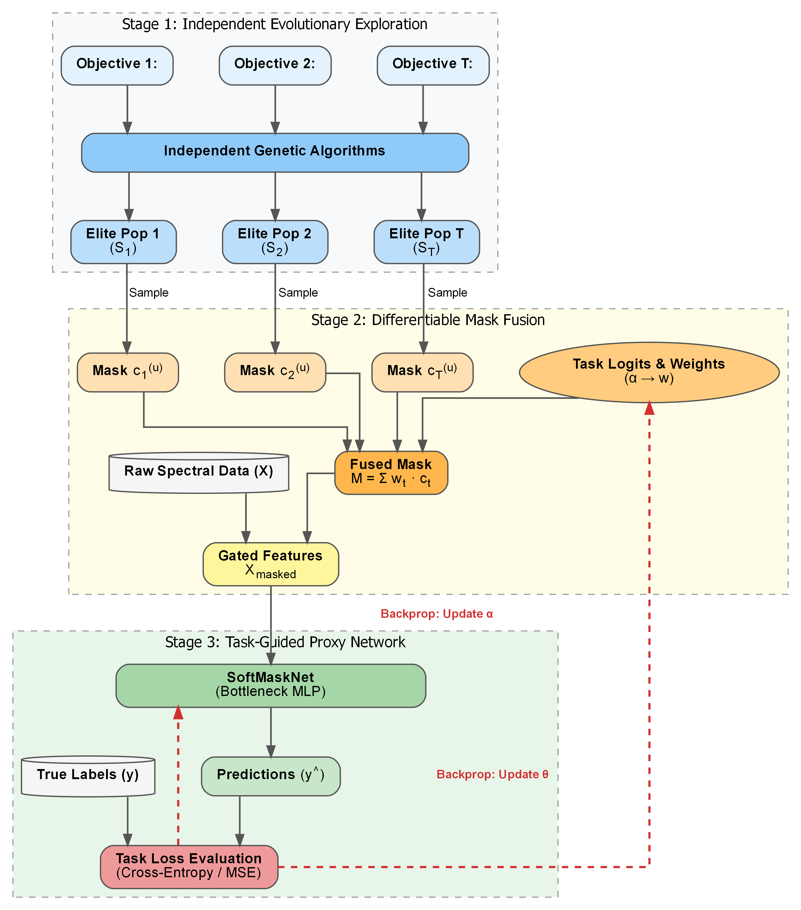

<div align="center">

# 🧬 Adaptive Task-Guided Feature Selection for Hyperspectral Data

**A Hybrid Evolutionary & Neural Network Approach**

[](https://www.python.org/downloads/)
[](https://pytorch.org/)
[](https://scikit-learn.org/)
[](https://opensource.org/licenses/MIT)
[](#)

</div>

> **TL;DR:** Instead of relying on passive, static Pareto-front sorting common in traditional Multi-Objective Evolutionary Algorithms (MOEAs), this framework introduces a **Weakly Supervised, Task-Guided Feature Aggregation** paradigm. It decouples the combinatorial search into independent Genetic Algorithm (GA) specialists and utilizes a differentiable gating network (**SoftMaskNet**) to adaptively learn optimal multi-objective weights driven directly by downstream predictive gradients.

<br>

<div align="center">
  
  
  
  <p><i>Figure 1: Overall architecture of the Hybrid GA-NN framework for task-guided feature selection.</i></p>
</div>

---

## 🧠 Core Methodology Overview 

1. **Decoupled Evolutionary Exploration**
   Each conflicting objective (Relevance, Redundancy, Target Regression, or Domain Independence) is assigned to an autonomous binary GA population. This eliminates negative transfer risks caused by traditional multitasking crossover and allows exhaustive exploration of local task landscapes.

2. **Differentiable Mask Fusion**
   During Stage 2 training, candidate chromosomes $c_t^{(u)}$ are stochastically sampled from each task's elite pool and aggregated via Softmax-normalized logits $\alpha$:
   
   $$M^{(u)} = \sum_{t=1}^{T} w_t \cdot c_t^{(u)}$$
   
   The raw continuous input is gated via element-wise multiplication: $x_{masked} = x_{raw} \odot M^{(u)}$, preserving higher-order non-linear band interactions.

3. **Task-Guided Proxy Backpropagation**
   The proxy network maps $x_{masked}$ directly to true labels $y_{true}$. The network parameters and task weight logits $\alpha$ are jointly updated end-to-end. If an evolutionary objective produces unstable or noise-prone bands that degrade downstream classification accuracy or raise regression MSE, gradient descent naturally drives its corresponding integration weight $w_t$ toward zero, acting as an automated regularizer.

---

## 📂 Repository Structure

The project follows a highly modular, decoupled architecture to ensure clean separation between data loading, evolutionary search, neural optimization, and evaluation:

* 📁 **core/**
  * 📄 `fitness_fast.py` — Pre-computed fast fitness functions (MI, Redundancy, Regression)
  * 📄 `ga_utils.py` — Evolutionary components (Roulette Wheel, Crossover, Mutation)
  * 📄 `networks.py` — SoftMaskNet core architectures & joint optimization loops
* 📁 **utils/**
  * 📄 `data_loader.py` — Standardized hyperspectral data loading and preprocessing
  * 📄 `metrics_tracker.py` — Statistical tracking, mean/std formatting, and paired t-tests
* 📁 **datasets/** *(Place your raw datasets here)*
  * 📊 `Spectral_DataSet.xlsx` — Dataset for Case Study 1
  * 📊 `DATASET.xlsx` — Dataset for Case Study 2
  * 📊 `Indian_pines_corrected.mat` — Dataset for Case Study 3
  * 📊 `Indian_pines_gt.mat` — Dataset for Case Study 3
 
* 🐍 **main_exp1_GrapevineDisease.py** — Entry: Case Study 1 (Temporal Transfer)
* 🐍 **main_exp2_Berry_Maturity.py** — Entry: Case Study 2 (Dual-Task Class + Reg)
* 🐍 **main_exp3_Indian_Pines.py** — Entry: Case Study 3 (Hierarchical Generalization)
* ⚙️ **requirements.txt** — Environment dependencies
* 📜 **LICENSE** — MIT License

---

## ⚙️ Environment Setup

The framework is verified on **Python 3.9** using **PyTorch 2.0.1** and **Scikit-Learn 1.2.2**. It is highly recommended to manage dependencies via an isolated virtual environment (e.g., Anaconda).

1. Clone this repository to your local machine:
```bash
git clone https://github.com/YourUsername/YourRepository.git
cd YourRepository
```

2. Install all required packages using the bundled requirements.txt:
```bash
pip install -r requirements.txt
```

---

## 📊 Data Preparation

Due to file size limits and hosting restrictions, the raw hyperspectral datasets are not included in this repository. Please download them from their respective public repositories and arrange them strictly within the datasets folder:

* **Grapevine Longitudinal Dataset**: Download the dataset and place `Spectral_DataSet.xlsx` into the `datasets/` folder.
  * 🔗 **[Download Link (Recherche Data Gouv)](https://doi.org/10.57745/KPNOJL)**
  * 📄 *Reference:* S. Zhang, E. Perrin, V. Vrabie, et al., Multi-annual spectral data of chardonnay grapevine leaves presenting yellows diseases and confounding symptoms, Scientific Data 12 (2025) 1956. [doi:10.1038/s41597-025-06080-8](https://doi.org/10.1038/s41597-025-06080-8).

* **Berry Maturity Dataset (Sugar)**: Download the dataset and place `DATASET.xlsx` into the `datasets/` folder.
  * 🔗 **[Download Link (Mendeley Data)](https://doi.org/10.17632/gjwx64sgkp.1)**
  * 📄 *Reference:* M. Ryckewaert et al., Dataset containing spectral data from hyperspectral imaging and sugar content measurements of grapes berries in various maturity stage, Data in Brief 46 (2023) 108822. [doi:10.1016/j.dib.2022.108822](https://doi.org/10.1016/j.dib.2022.108822).

* **Indian Pines Benchmark**: Download `Indian_pines_corrected.mat` and `Indian_pines_gt.mat` and place them into the `datasets/` folder.
  * 🔗 **[Download Link (Purdue PURR)](https://doi.org/10.4231/R7RX991C)**
  * 📄 *Reference:* M. F. Baumgardner, L. L. Biehl, D. A. Landgrebe, 220 band AVIRIS hyperspectral image data set: June 12, 1992 Indian Pine test site 3 (2015). [doi:10.4231/R7RX991C](https://doi.org/10.4231/R7RX991C).
---

## 🚀 Running the Experiments

We provide three clean, independent entry scripts corresponding to the case studies presented in the manuscript. Each script handles local data pre-processing, spawns independent GA optimizations, trains the task-guided SoftMaskNet, and prints well-formatted evaluation tables (`Mean ± Std`) directly to the console.

### Case Study 1: Robustness to Temporal Confounders (Grapevine Disease)
Evaluates out-of-distribution generalization using a challenging Leave-One-Year-Out (LOYO) validation to isolate stable pathological markers against inter-annual climatic variations.
```bash
python main_exp1_GrapevineDisease.py
```

### Case Study 2: Multi-Task Generalization (Berry Maturity)
Simultaneously optimizes a single parsimonious mask for heterogeneous targets: categorical genotype classification (variety) and continuous physiological regression (sugar/Brix).
```bash
python main_exp2_Berry_Maturity.py
```

### Case Study 3: Hierarchical Multi-Task Mapping (Indian Pines)
Reconciles misaligned abstraction granularities by forcing the network to maintain micro-level discriminative power (16 fine-grained classes) and macro-level semantic consistency (Crop vs Non-Crop).
```bash
python main_exp3_Indian_Pines.py
```

---

## 📄 License & Citation

This project is licensed under the **MIT License** - see the LICENSE file for details. It is free to use, modify, and distribute for academic and commercial purposes, provided the original copyright notice is preserved.

If you find this code or our framework useful in your research, please consider citing our paper (Currently Under Review).

## ✉️ Contact
For any technical issues or implementation questions, please open an **Issue** in this repository or contact the authors directly.
